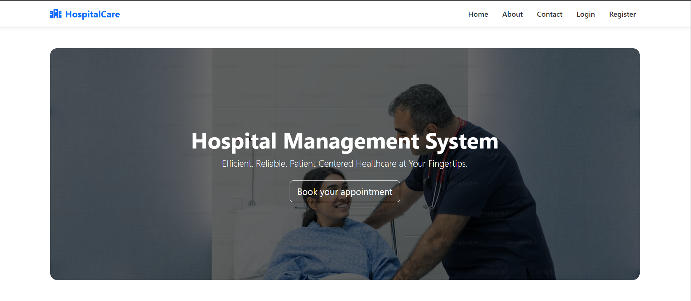
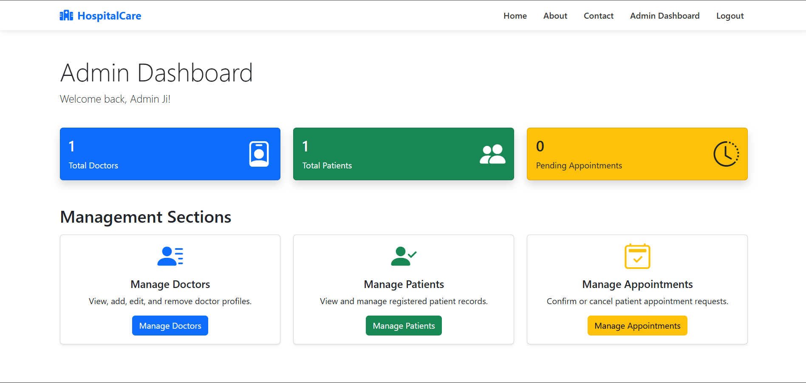
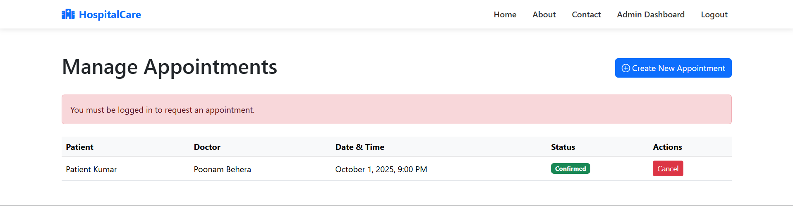

HospitalCare

✨ Core Features
This project is built with a three-tier user system, where each role has a tailored experience and specific permissions.

👨‍💼 Administrator Portal
Secure Dashboard: An overview of hospital statistics (total doctors, patients, pending appointments).

Doctor Management (CRUD): Full capabilities to Create, Read, Update, and Delete doctor profiles.

Patient Management: View a comprehensive list of all patient profiles and manage their details.

Advanced Appointment Management:

View all appointments in the system.

Confirm pending requests and assign a specific time.

Cancel pending or confirmed appointments.

Create appointments on behalf of patients.

Automated Email Notifications: Automatically sends confirmation and cancellation emails to patients.

👨‍⚕️ Doctor Portal
Personalized Dashboard: Welcomes the doctor by name and shows a list of their upcoming, confirmed appointments.

Availability Management: A dedicated page for doctors to set their weekly working hours (e.g., Monday 9 AM - 5 PM, Tuesday off), which controls their booking availability.

🙍 Patient Portal
Secure Registration & Login:

Robust user registration with password confirmation.

OTP Email Verification to ensure valid email addresses.

Profile Management: A one-time setup for patients to add their personal details (DOB, address, etc.).

Dynamic Appointment Booking:

An intelligent form that first requires the user to select a department/specialization.

AJAX-powered dependent dropdown then loads only the doctors relevant to that specialty.

The system checks the doctor's weekly availability before allowing a date to be requested.

Appointment History: A dedicated page for patients to view their complete appointment history (past and upcoming).

Self-Service Cancellation: Patients can cancel their own future appointments.

💻 Technology Stack
Backend: PHP 8+

Database: MySQL

Frontend: HTML5, CSS3, JavaScript (ES6)

Framework/Libraries: Bootstrap 5, PHPMailer

Dependency Management: Composer

🚀 Key Technical Highlights
This project was built with modern, secure development practices in mind.

Role-Based Access Control (RBAC): Every page is protected by a session-based "guard clause" that verifies the user's role (admin, doctor, patient), ensuring strict permission boundaries.

Secure Database Operations: All database queries utilize Prepared Statements (prepare, bind_param, execute) to completely prevent SQL injection vulnerabilities.

Password Security: User passwords are never stored in plaintext. They are securely hashed using PHP's native password_hash() function and verified with password_verify().

Transactional Integrity: Critical operations, like creating a new doctor (which involves inserting into two separate tables: users and doctors), are wrapped in database transactions to ensure data consistency.

AJAX for Dynamic UI: The patient appointment form uses AJAX (fetch API) to create a smooth user experience, dynamically updating the list of available doctors without requiring a page reload.

Robust Email System: All email functionalities (OTP, confirmations, cancellations) are handled via SMTP using the industry-standard PHPMailer library and a Gmail App Password for secure and reliable delivery.

🛠️ Getting Started: Configuration and Setup
Follow these steps to get the project running on your local machine.

1. Prerequisites
XAMPP: with PHP 8.0+ and MySQL.

Composer: Installed globally.

Web Browser: Chrome, Firefox, or Edge.

Code Editor: VS Code is recommended.

2. Database Setup
Start the Apache and MySQL services in your XAMPP Control Panel.

Open your web browser and go to http://localhost/phpmyadmin/.

Create a new database named hospital_db.

Click on the hospital_db database and go to the "SQL" tab.

Copy the entire content from the database.sql file (create this file and add the schemas below) and paste it into the SQL query box, then click "Go".

database.sql:

SQL

-- Paste the complete schemas for users, doctors, patients, appointments, and doctor_availability here.
3. Backend Configuration
Clone/Download: Place the project folder (php_files) inside your C:\xampp\htdocs\ directory.

Install Dependencies: Open a terminal in the project's root directory (C:\xampp\htdocs\php_files\) and run:

Bash

composer install
Configure config.php: Open /includes/config.php and ensure the BASE_URL is correct for your setup.

PHP

define('BASE_URL', 'http://localhost/php_files/');
Configure db.php: Open /includes/db.php and verify that the database credentials are correct (by default, XAMPP uses root with no password).

Configure send_email.php: Open /includes/send_email.php and enter your Gmail email and the 16-digit App Password you generated.

4. Running the Application
Open your web browser and navigate to: http://localhost/php_files/

The homepage should now be visible. You can register new accounts or use sample accounts if you added them to your database.sql file.

🔮 Future Enhancements
Implement a "My Profile" page for patients to edit their details.

Integrate the doctor's availability schedule to block out specific time slots.

Add a section for patient medical records and visit notes, visible to doctors.

Real-time notifications for appointment reminders.#
